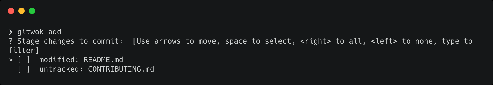
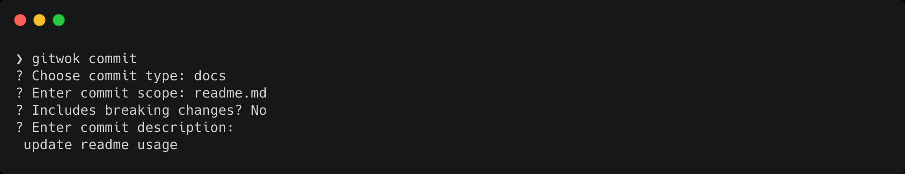

<p align="center">
  
  <h3 align="center">GitWok</h3>
  <p align="center">Configurable CLI with conventional commits, changelog, git hooks all in one</p>
</p>

<p>
  <a href="https://github.com/Roytangrb/gitwok/actions">
    
  </a>
  <a href="https://codecov.io/gh/Roytangrb/gitwok">
    
  </a>
  <a href="https://goreportcard.com/report/github.com/Roytangrb/gitwok">
    
  </a>
</p>

## Table of Contents
<details>
<summary>Install</summary>

- [Go get](#go-get)
- [Homebrew](#homebrew)

</details>

<details>
<summary>Usage</summary>

- [`add` command](#add-command)
- [`commit` command](#commit-command)

</details>

<details>
<summary>Configuration</summary>

- [commit](#commit-config)
- [changelog](#changelog-config)

</details>

## Overview

## Install

### Go get

If you have `Go` setup on your machine, get and install by:
```
$ go get -u github.com/Roytangrb/gitwok
```
`gitwok` executable should be available if `$GOPATH/bin` is already in your `PATH`, otherwise put the binary in one of your `PATH` directories

### Homebrew

To install on a Mac with [homebrew](https://brew.sh/) installed, run:
```
$ brew tap roytangrb/gitwok
$ brew install gitwok
```

## Usage

```
Usage:
  gitwok [flags]
  gitwok [command]

Available Commands:
  add         stage changes
  commit      build and make conventional commit
  help        Help about any command
  version     print version

Flags:
      --config string   config file (default is ./gitwok.yaml)
  -n, --dry-run         dry run all git exec actions
  -h, --help            help for gitwok
  -v, --verbose         verbose output

Use "gitwok [command] --help" for more information about a command.
```

> For git related commands, you may run `gitwok [command] [--verbose | -v] [--dry-run | -n]` to see verbose output without actually applying changes.

### `add` command

The add subcommand prompts for selecting unstaged changes of the current directory to be added for commiting.
```
$ gitwok add
```


### `commit` command

The `commit` subcommand is used for building the commit message following <a href="https://www.conventionalcommits.org/en/v1.0.0/" target="_blank"></a> specification, and execute `git commit -m <msg>`.

#### `flags` mode

You can build the commit message using flags for subcommand `commit`, example: 
```
$ gitwok commit -t docs -s readme.md -d "commit command usage"
```
which commits with a simple and valid message:
```
docs(readme.md): commit command usage
```
You can check all flags by `gitwok commit --help`

#### `interactive` mode

You may also build the commit message interactively by running:
```
$ gitwok commit
```
You will be prompted for selecting/entering each commit message component.



## Configuration

Configuration allows you to customize subcommands for more handy usage and avoid repeating dummy input.

For example, you could provide a preset of commit `scope` to choose from while commiting, or skip the `body` and `footers` prompts by default.

Examples and full options could be found in [`docs/config`](https://github.com/Roytangrb/gitwok/tree/main/docs/config/).

To apply a config file, you may specify a full path and name, i.e.:
```
$ gitwok commit --config "/path/to/your/config.yaml"
```
When no file path is set explictly by `--config` flag, it will look for a default `gitwok.yaml` file in the current working directory and then in your home directory.

In the absence of a config file, default config will apply.

### commit config

* Toggle prompt of the optional fields in a commit msg, with boolean value
* Set `type` options for selecting, default types are: `fix`, `feat`, `build`, `chore`, `ci`, `docs`, `perf`, `refactor`, `style`, `test`.
* Set `scope` options for selecting. If no option is given, the prompt will become a single line input instead of a select.

```yml
# yaml
gitwok:
  commit:
    prompt:
      scope: true     # default true
      breaking: true  # default true
      body: true      # default true
      footers: true   # default true
    type:
      - fix
      - feat
      # ...
    scope:
      - readme.md
      - release
      # ...
```

### changelog config

> coming soon

## Reference
* [Conventional Commits 1.0.0](https://www.conventionalcommits.org/en/v1.0.0/)
* [Cobra](https://github.com/spf13/cobra)
* [PFlag](https://github.com/spf13/pflag)
* [Viper](https://github.com/spf13/viper)
* [Survey](https://github.com/AlecAivazis/survey)
* [Carbon](https://carbon.now.sh/)